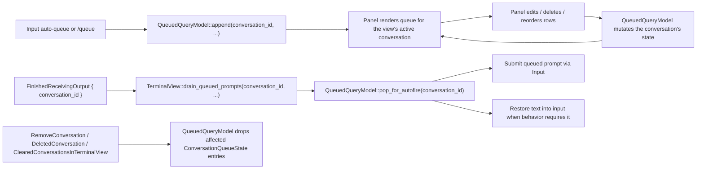

# Queued Prompts UI — Technical Spec
See `specs/REMOTE-1543/PRODUCT.md` for user-visible behavior. This document covers the implementation that supports that behavior.
## Context
Regular Agent Mode queued prompts are stored in an app-wide singleton keyed by conversation id, so queue state outlives the agent-view session that originated it. The rendered panel sits next to the input that hosts it, while queue data is owned globally.

The implementation spans four ownership layers:
- `app/src/ai/blocklist/queued_query.rs` defines the `QueuedQueryModel` singleton. It owns every conversation's queue rows, edit state, and auto-queue toggle, indexed by `AIConversationId`. It self-manages cleanup by subscribing to `BlocklistAIHistoryModel` lifecycle events.
- `app/src/terminal/view.rs` wires the input and panel, subscribes to panel events for input mutation, and drains queued prompts when a conversation finishes — using the `conversation_id` carried on `BlocklistAIControllerEvent::FinishedReceivingOutput`.
- `app/src/terminal/view/queued_prompts_panel.rs` owns panel rendering and row-level interactions: collapse, edit, delete, drag reorder, and panel telemetry. The panel looks up the active conversation for its terminal view via `BlocklistAIHistoryModel` rather than duplicating that state.
- `app/src/terminal/input.rs` and `app/src/terminal/input/slash_commands/mod.rs` route regular queue trigger surfaces into the singleton, scoped to the conversation each trigger fires against.

Cloud Mode placeholders and compact follow-up placeholders remain on the legacy pending-user-query path. They still use the rich-content machinery in `app/src/terminal/view/pending_user_query.rs`, `app/src/terminal/view/rich_content.rs`, and related terminal selection plumbing because their lifecycle is driven by cloud setup or summarize/fork workflows rather than by regular Agent Mode queue draining.
## Proposed changes
### Queue ownership and data model
`QueuedQueryModel` is an app-wide singleton (`SingletonEntity`) keyed by `AIConversationId`. It is the source of truth for every regular queued prompt anywhere in the app (`app/src/ai/blocklist/queued_query.rs`):
- `queues: HashMap<AIConversationId, ConversationQueueState>` stores each conversation's per-conversation state. Conversations that have never been touched have no entry; reads against an absent key return empty/false, so a missing entry is indistinguishable from a conversation with an empty queue and toggle off.
- `ConversationQueueState { queue: Vec<QueuedQuery>, editing: Option<QueuedQueryId>, queue_next_prompt_enabled: bool }` packages all per-conversation state in one struct so a conversation's queue, in-progress edit, and auto-queue toggle live and die together.
- `QueuedQueryId` gives each row stable identity across edit, delete, and reorder.
- `QueuedQueryOrigin` distinguishes `/queue` rows from auto-queue rows for telemetry without affecting firing semantics.

Every queue/edit/toggle accessor takes the `conversation_id` it applies to, and the singleton emits `QueuedQueryEvent`s whose payload carries that `conversation_id` so subscribers can filter by the conversation they care about. Panel collapse is panel-local UI state and lives on `QueuedPromptsPanelView`, not on the singleton, because no other consumer cares.

`QueuedQueryModel` self-manages cleanup by subscribing to `BlocklistAIHistoryModel`:
- `RemoveConversation { conversation_id, .. }` and `DeletedConversation { conversation_id, .. }` drop that conversation's `ConversationQueueState`.
- `ClearedConversationsInTerminalView { cleared_conversation_ids, .. }` drops every entry whose id appears in the cleared list. The history event is extended to include `cleared_conversation_ids: Vec<AIConversationId>` — `BlocklistAIHistoryModel::clear_conversations_in_terminal_view` already collects those ids; the event just needs to carry them.

No subscription is added for `ExitedAgentView`. Conversations outlive their visible session — particularly for cloud agents — so the queue and its toggle state must too.
### Trigger routing and enqueue flow
All regular queue entry points target `QueuedQueryModel::append(conversation_id, ...)` on the singleton, scoped to the conversation the trigger fires against:
- The auto-queue path in `Input::maybe_queue_input_for_in_progress_conversation` verifies that the conversation-scoped toggle is enabled, AI input is active, the selected conversation is in progress or blocked, and the prompt is non-empty. It then calls the singleton to append an `AutoQueueToggle` row to that `conversation_id` (`app/src/terminal/input.rs`). The toggle read uses the same conversation id.
- `/queue <prompt>` appends a `QueueSlashCommand` row to the in-progress conversation's queue, and otherwise falls back to normal submission (`app/src/terminal/input/slash_commands/mod.rs`). The `conversation_id` is the in-progress conversation derived from the same gating check.
- The `ToggleQueueNextPrompt` action handler in `TerminalView` (`app/src/terminal/view.rs`) looks up the view's active conversation id via `BlocklistAIHistoryModel::active_conversation_id(self.view_id)` and calls `QueuedQueryModel::toggle_queue_next_prompt(conversation_id, ctx)`. When the view has no active conversation, the action is a no-op.

`FeatureFlag::QueueSlashCommand` remains the single gate for the regular queue experience. It covers the trigger surfaces above and the panel attachment/render path; there is no separate panel-specific rollout switch.
### Panel composition and interaction ownership
`Input::new` constructs `QueuedPromptsPanelView` when the regular queue feature is available, passing the parent terminal view's `EntityId` so the panel can look up the active conversation it should render for (`app/src/terminal/input.rs`). The panel handle is stored on `Input`, and the input render tree places the panel between the status bar and the editor (`app/src/terminal/input/agent.rs`), matching the product placement contract. `Input` subscribes to panel events for cross-component side effects.

`QueuedPromptsPanelView` intentionally owns only queue-panel concerns (`app/src/terminal/view/queued_prompts_panel.rs`):
- It renders the queue header, expanded rows, hover controls, inline edit editor, and drag handles.
- Static rows render bounded multiline previews: prompt text is character-trimmed before rendering, then constrained to a compact maximum height so queued prompts remain readable without letting one row dominate the panel.
- Edit mode reuses the multiline editor pattern used elsewhere in the client (`EditorOptions` with autogrow + soft wrap), constrains the editor to the same visual height as the static preview, and wraps it in a clipped outlined scroll surface with a scrollbar so larger edits stay bounded inside the row.
- It mutates queue state through `QueuedQueryModel` methods scoped to the panel's current active conversation: `enter_edit_mode`, `remove_by_id`, `commit_edit`, `cancel_edit`, and `reorder`.
- It emits higher-level `QueuedPromptsPanelEvent`s when the host view must coordinate with input focus or buffer placement.
- Panel-only UI state — `collapsed`, `row_states`, drag state — lives on the view itself, not on the singleton, because no other consumer cares.

The panel resolves "which conversation am I rendering for?" via `BlocklistAIHistoryModel::active_conversation_id(terminal_view_id)`. It subscribes to `BlocklistAIHistoryEvent::SetActiveConversation` filtered to its terminal view so it can re-seed `row_states` and reset `collapsed` when the active conversation changes. It also subscribes to `QueuedQueryModel` events and ignores any whose `conversation_id` does not match the current active conversation.

`TerminalView::handle_queued_prompts_panel_event` (delegated through `Input`) owns the cross-component consequences the panel should not perform directly: focus restoration and placing deleted text into the main input when the input is empty.
### Drain behavior and conversation lifecycle
When a conversation finishes, `TerminalView` decides how that conversation's queued prompts advance; the queued prompts panel only renders and edits queued rows. `BlocklistAIControllerEvent::FinishedReceivingOutput` carries the `conversation_id` that just finished, and `TerminalView::handle_ai_controller_event` threads it through `handle_finished_conversation` into `drain_queued_prompts(conversation_id, finish_reason, ctx)` (`app/src/terminal/view.rs`). Explicit threading keeps drain correct when the finishing conversation is not the view's currently-active conversation (e.g. a backgrounded child agent).

`drain_queued_prompts` branches on `FinishReason`:
- `Complete`: pop one queued row from that conversation via `QueuedQueryModel::pop_for_autofire(conversation_id, ctx)`; submit it through `Input::submit_queued_prompt`, or place it into the input if the row was first in queue and in edit mode.
- `Error`, `Cancelled`, or `CancelledDuringRequestedCommandExecution`: first gate on `AgentViewController::agent_view_state().active_conversation_id() == Some(conversation_id)` — restore only when the user is currently viewing this conversation in agent view. `AgentViewController::exit_agent_view_internal` flips the state to `Inactive` before emitting `ExitedAgentView`, so cancels driven by agent-view exit reach the drain with the state already cleared and skip the restore. Backgrounded conversations the user isn't viewing also skip on the same check. Once gated past that, if the input is empty, pop the first row of that conversation's queue and place its text into the input; otherwise leave the queue untouched.

The model owns row-removal details and per-conversation state mutation, while the terminal owns submission and input mutation. This division keeps queue semantics testable in `queued_query_tests.rs` while preserving terminal-specific side effects in `queued_prompts_tests.rs`.

Queue and toggle state are dropped only by `QueuedQueryModel`'s own subscriptions to `BlocklistAIHistoryModel`:
- `RemoveConversation { conversation_id, .. }` and `DeletedConversation { conversation_id, .. }` drop that conversation's `ConversationQueueState` entry.
- `ClearedConversationsInTerminalView { cleared_conversation_ids, .. }` drops every entry in the cleared list. The event is extended to carry `cleared_conversation_ids: Vec<AIConversationId>` alongside the existing `active_conversation_id`.
- `ExitedAgentView` is intentionally not subscribed to. Conversations and their queues outlive the agent-view session that originated them; re-entering the agent view, or switching to the conversation from anywhere else, restores the same queue and toggle state.
### Compatibility boundary for legacy pending placeholders
The regular queue subsystem does not absorb placeholder flows whose lifecycle is unrelated to conversation-completion draining:
- Cloud Mode initial/follow-up placeholders continue using pending-user-query rich content.
- `/compact-and` and `/fork-and-compact` continue using the summarize/fork placeholder path.

This boundary matters architecturally because these placeholders are owned by cloud or summarize/fork workflows, not by `QueuedQueryModel`. Keeping them separate avoids forcing prompt placeholders into queue APIs whose responsibilities are append, inspect, edit, reorder, and drain regular Agent Mode follow-ups.
### Telemetry
Panel-only interaction telemetry is emitted from `QueuedPromptsPanelView`, where the interaction actually occurs:
- `QueuedPrompt.Edited`
- `QueuedPrompt.Deleted`
- `QueuedPrompt.Reordered`
- `QueuedPrompt.PanelCollapseToggled`

`app/src/server/telemetry/events.rs (1205-1228, 2947-2971, 5848-5859)` mirrors queue-row origin into telemetry payloads and associates these events with `FeatureFlag::QueueSlashCommand`.
## End-to-end flow

## Testing and validation
Map tests directly to the product behavior in `specs/REMOTE-1543/PRODUCT.md`:
- Behaviors 4-11: regular queue gating, `/queue`, auto-queue, shell-mode exclusion, and per-conversation isolation should stay covered by terminal/input-level tests plus slash-command coverage. Add coverage that appending or toggling on one conversation does not affect another conversation's state.
- Behaviors 12-31: row rendering, collapse/edit/delete/reorder semantics belong in `app/src/terminal/view/queued_prompts_tests.rs` and `app/src/ai/blocklist/queued_query_tests.rs`. Tests construct queues against explicit conversation ids and assert per-conversation isolation.
- Behaviors 32-38: sequential firing, edit-mode drain handling, and cancellation/error restoration belong in `TerminalView::drain_queued_prompts` coverage in `app/src/terminal/view/queued_prompts_tests.rs`. Drain tests construct the queue for a specific conversation id and verify the popped row is from that conversation.
- Behaviors 39-41: conversation/terminal/Agent View cleanup belong in queue-model lifecycle tests. Specifically cover (a) `ExitedAgentView` does not touch queue state, (b) `RemoveConversation`/`DeletedConversation` drops only the targeted conversation's entry, and (c) `ClearedConversationsInTerminalView` drops every conversation in `cleared_conversation_ids`. Also cover the auto-queue toggle: it persists across agent-view exit and is dropped together with the queue on cleanup.
- Behavior 44: telemetry payload/origin plumbing should be covered where telemetry event serialization or event wiring already has local test patterns.

Validation for this implementation should use:
- `cargo fmt`
- Targeted compile/test coverage for queued prompt model and terminal view queue behavior
- Full presubmit before PR submission

Do not run the app as part of this change.
## Parallelization
Parallel child agents are not especially helpful for implementing this feature because the queue model, panel, input routing, and terminal drain semantics share tight ownership boundaries and must remain consistent across one architectural thread. Review and validation can be parallelized later, but the primary implementation should stay in a single workstream to avoid churn across the same types and event contracts.
## Risks and mitigations
- **Queue lifecycle drifting from conversation lifecycle**: centralize cleanup inside `QueuedQueryModel`'s own subscriptions to `BlocklistAIHistoryModel` (deletion + clear-conversations). `TerminalView` is no longer responsible for clearing queue state; agent-view exit is intentionally not a cleanup trigger.
- **Drain firing against the wrong conversation**: thread `conversation_id` from `BlocklistAIControllerEvent::FinishedReceivingOutput` explicitly into `drain_queued_prompts` rather than relying on the view's "active conversation" being the same as the finished one.
- **Panel rendering stale rows when active conversation changes**: re-seed `row_states` and reset `collapsed` in the panel's `BlocklistAIHistoryEvent::SetActiveConversation` subscription, and ignore `QueuedQueryEvent`s whose `conversation_id` does not match the current active conversation.
- **Panel owning terminal/input side effects**: keep focus restoration and input-buffer placement in `TerminalView::handle_queued_prompts_panel_event`.
- **Drain behavior losing edit-mode or cancellation semantics**: keep firing policy in `TerminalView::drain_queued_prompts` and row-removal mechanics in `QueuedQueryModel`.
- **Compatibility placeholders leaking into regular queue abstractions**: keep Cloud Mode and compact follow-up placeholders on their existing pending-user-query path because their ownership and removal semantics differ.
